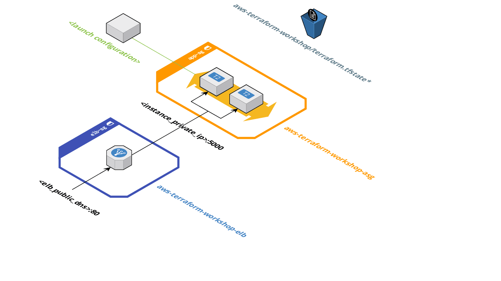

# AWS Terraform Workshop

Examples about Infrastructure as Code, using [Terraform](https://www.terraform.io/) and [AWS](https://aws.amazon.com/)

Sample application: [Hello From](https://github.com/facevedom/hello-from)



## Getting Started
### Set up your local environment
- [Install Terraform](https://www.terraform.io/intro/getting-started/install.html)
- Install AWS CLI. If you have Pip, just run 
```
pip install awscli
```
- Configure AWS CLI with your AWS credentials
```
aws configure
```
- Clone this repository
- (Optional) install and use [Landscape](https://github.com/coinbase/terraform-landscape)

## State 1
### Features
- An EC2 instance
- A security group
- User data
- Local tfstate
### Concepts :pencil2:
- HCL
- Provider
- Resource
- State
- Init
- Plan
- Apply
- Destroy

## State 2
### Features
- Remote backend :grin:
- Variables
- Outputs
### Concepts :pencil2:
- Variables
- Outputs
- Count


```
terraform plan -var 'vpc_id=vpc-953f78ee' -var 'app_port=5000' -var 'instance_type=t2.micro' -var 'subnet_id=subnet-b1455dec' -var 'key_name=aws-terraform-workshop'
```

```
terraform plan -var 'vpc_id=vpc-953f78ee' -var 'app_port=5000' -var 'instance_type=t2.micro' -var 'subnet_id=subnet-b1455dec' -var 'key_name=aws-terraform-workshop' -var 'instances=2'
```

## State 3
### Features
- A launch configuration
- An autoscaling group
- An ELB

This is the definitive infrastructure
### Concepts :pencil2:
- Variables file
- Lists

```
terraform plan -var-file=myvars.tfvars
```
## State 4
### Features
- "Environments"

### Concepts :pencil2:
- Modules
- _ifs_ (interpolation)
